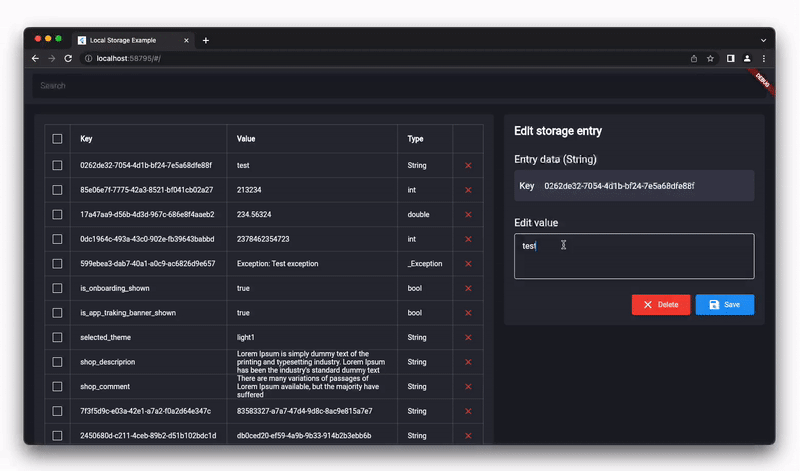

<h1 align="center"> StorageView 🔎</h1>
<h3 align="center"> Flutter inspector tool for any database, storage and shared_preferences.  Check and modify database values from UI of application.</h3>

Show some ❤️ and <a href="https://github.com/Frezyx/storage_view">star the repo</a> to support the project!

  

